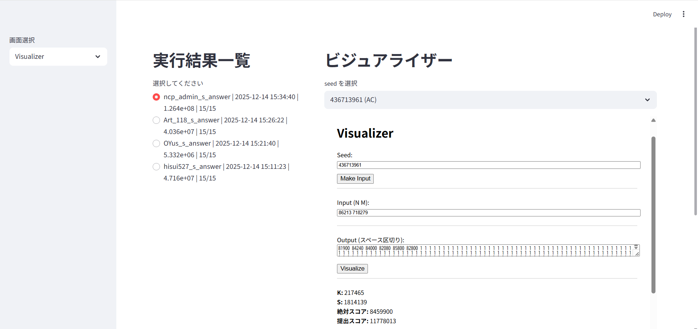
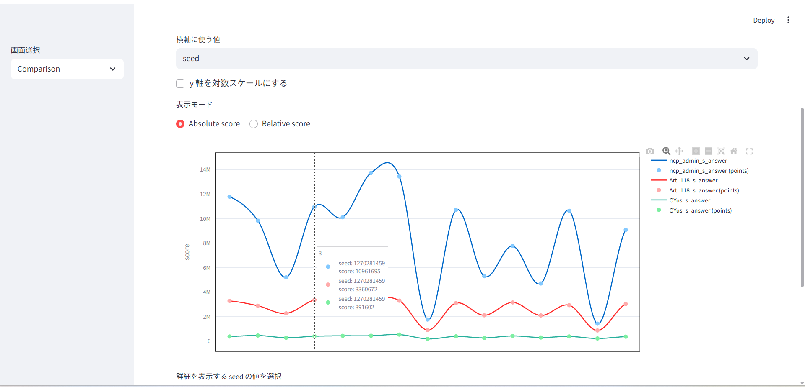

# npc-heuristic-visualizer

**Nanyo Programming Contest -heauristic- の問題を解く際に使えるテスト実行管理ツールです。**

## 概要
[vscode-npc-gen-runner](https://github.com/kyoplayer/vscode-npc-gen-runner)のヒューリスティック専用のコマンドを実行した際に作られるlogsフォルダーの中身から過去実行を管理し、実行履歴の確認、ビジュアライザ表示、実行結果の分析を行うことができます。


## 機能一覧

npc-heauristic-visualizerは2つの画面からなり、

- 実行履歴の管理 および ビジュアライザでの確認
- 実行結果の分析

を行うことができます。

### 実行履歴の管理 および ビジュアライザでの確認
この画面では、主にビジュアライザによる結果の分析を行うことができます。


画面左部には実行一覧が表示され、左から順に、

- 実行時に付けたコメント
- 実行日時
- 総合スコア
- AC数/全体数

です。

画面右側には、適切に設定を行うことでビジュアライザが生成されます。上のバーをクリックすると中身が展開され、その中から任意のseed値を選ぶことでその時のビジュアライザを見ることができます。

また、左側の実行一覧の中から選択することで、該当する実行を変更することができます。

### 実行結果の分析
この画面では、seed値、あるいは問題中の変数の値からグラフを作成します。


この写真上では見切れていますが、このさらに上に実行一覧があり、それを選択することで、その実行をグラフに反映させることができます。これは1つ以上任意の数選択することができます。

デフォルトではseed値が横軸に取られ、縦軸はスコアをとります。横軸については、入力の値(例:N,M)にすることも可能です。ただし、**vscode-npc-gen-runnerで実行するときに、設定でshered_varsに入っている変数に限ります。すなわち、shared_varsにN,Mが入っている状態で実行させたとき、本ツールではN,Mを横軸にとるグラフを作成することはできますが、例えばKといったshared_varsに入っていなかった変数については使用できません。また、vscode-npc-gen-runnerのバージョンが0.2.5以上である必要があります。**

グラフにカーソルを合わせると、点の詳細な情報を知ることができます。

また、相対スコアとして表示することもできます。

ちなみに、グラフはぐりぐり動かせます(やったね！)

## 要求環境

- `Python`(バージョンが3.13.11以前のもの。3.14以降はstreamlitが対応していない可能性有)
- `vscode-npc-gen-runner`(バージョンが0.2.4以下のものは機能が制限されます)
- `streamlit`
- `NumPy`
- `Plotly`


## 使用方法
初回の場合は以下の操作を行わなければならない。

0. `vscode-npc-gen-runner`を用いて実行履歴を作る。ここで、`logs`というフォルダがあることを確認する。
1. `Python`のバージョンを確認する。

```powershell
py --version
```
を実行するとPythonのバージョンが確認できる。これが3.13.11以下なら4へスキップ。3.14などのバージョンである場合は2に進む。

2. [Pythonのダウンロードページ](https://www.python.org/downloads/)からPython3.13.11以下のバージョンをダウンロードする。適宜Pathを通す。既に存在する場合は新たにダウンロードする必要はない。

3. VScode上を開き、`logs`フォルダのあるディレクトリを開く。次に、`Ctrl + shift + P`を押してコマンドパレットを開いたのち、`Python: Select Interpreter`を選択し、`仮想環境の作成` -> `Venv` -> 先ほどダウンロードしたバージョンを選ぶ。その後ターミナルを開きなおし、`(.venv) PS C:\...`という形式で表示されていれば成功。

4. `streamlit`、`NumPy`や`Plotly`のような外部ライブラリや、`pip`を用意する
```powershell
curl https://bootstrap.pypa.io/get-pip.py -o get-pip.py
python get-pip.py
```
以上のコマンドでpipをインストールできる。次に、
```powershell
pip install streamlit
pip install numpy
pip install plotly
```
で外部ライブラリをインストールする。正常にインストールできれば成功である。

5. このパッケージをインストールする。`git`が存在する場合は、
```
git clone https://github.com/kyoplayer/npc-heuristic-visualizer.git
```
で中身を取得するのが最も早い。

`git`が存在しない場合は、[Githubのページ](https://github.com/kyoplayer/npc-heuristic-visualizer)を開いて、`Code`から`Downlord ZIP`からダウンロードし、それをディレクトリ内に置くのがよい。

このツールに限らず`git`は便利なので、インストールしておくのがよいだろう。[リンク](https://git-scm.com/book/ja/v2/%E4%BD%BF%E3%81%84%E5%A7%8B%E3%82%81%E3%82%8B-Git%E3%81%AE%E3%82%A4%E3%83%B3%E3%82%B9%E3%83%88%E3%83%BC%E3%83%AB)

なお、フォルダ構成は次のようになっていなければならない。
```
root\
   ├─ npc-heuristic-visualizer\
   │                     ├─ img\
   │                     ├─ app.py
   │                     ├─ config.json
   │                     └─ readme.md
   ├─ logs\
```


### アプリを起動する
仮想環境を立てた場合は、仮想環境が開いていることを確認したうえで(仮想環境を立てていない場合は特に何も気にすることはない)、ターミナルで
```
streamlit run .\npc-heuristic-visualizer\app.py
```
を実行する。すると、デフォルトのブラウザ上でアプリケーションが起動するはずである。

## config.json
`./npc-heuristic-visualizer/config.json`をいじることで設定を変えることができます。

- `max_or_min` : スコアが大きければ大きいほどよいとされるのか、その逆なのかを設定できます。`max`と書けばスコアが大きければ大きいほど良いとされることを示し、`min`と書けばスコアが小さければ小さいほど良いとされます。

- `visualizer_URL` : ビジュアライザのURLを貼ってください。デフォルトはNPCH001のものです。

## 注意
ビジュアライザについては、Writerの気分によってはうまく動かないことがあります。ご了承を。

※Writerに向けて<br>
seed値を入れる欄は`id = seedBox`、出力を入れる欄は`id = outputBox`というidを振ってくれると正常に作動することができます。できればそのようにお願いします。

## バージョン
|更新日時|内容|バージョン|
|----|----|----|
|12/15|基本的な機能を搭載して初リリース|0.1.0|